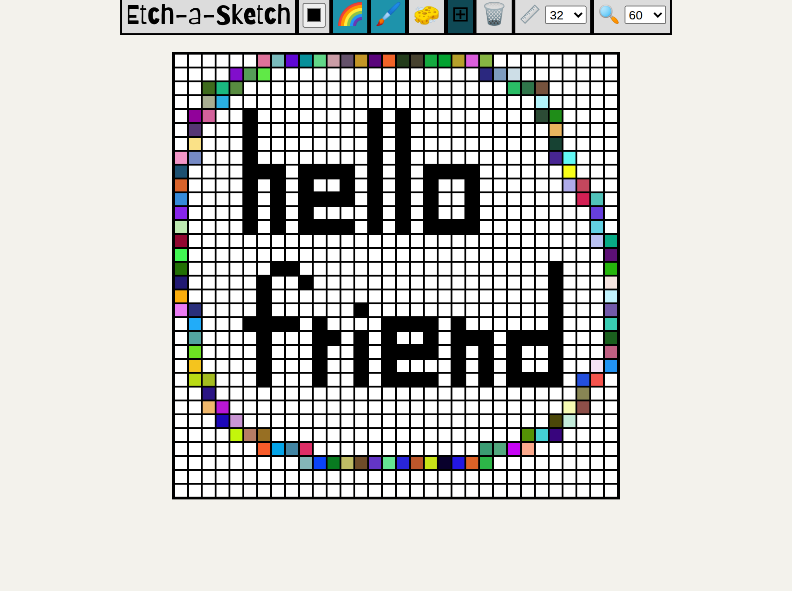
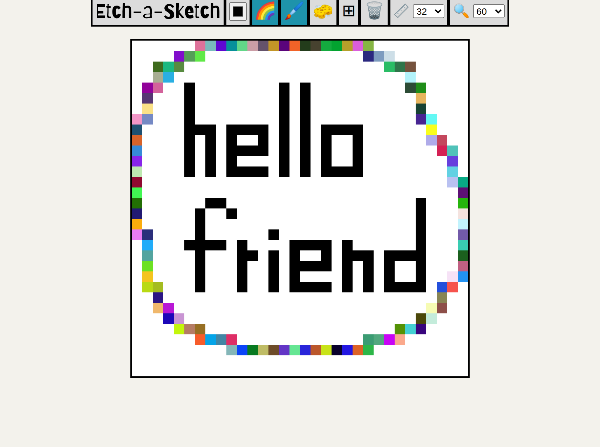

# etch_a_sketch

This project is an Etch A Sketch–style pixel drawing app built as part of The Odin Project’s Foundations curriculum.

## Features
- Interactive pixel grid for drawing  
- Brush for coloring cells  
- Eraser mode  
- Grid size control, resizable up to 100 x 100 cells (as required by the assignment)  

## Tech Stack
- JavaScript (vanilla)  
- HTML  
- CSS  

## Extra Features
- Scroll-to-zoom functionality for focusing in on the canvas  
- Rainbow color mode  
- Grid overlay for precise cell boundaries  
- Stable coloring (no progressive darkening when recoloring the same cell)  

## Preview

  
  

## Future Improvements
- Mobile-friendly responsive design  
- Export drawing as an image (PNG)  
- Better touch support and palm rejection for mobile  
- Performance tuning for large grids  
- Keyboard shortcuts (brush/eraser/rainbow, clear, zoom)  
- Undo/redo and color history  

## Acknowledgements
- Built as part of The Odin Project’s [Foundations course](https://www.theodinproject.com/lessons/foundations-etch-a-sketch)  
- Fonts provided by [Google Fonts](https://fonts.google.com/)  
